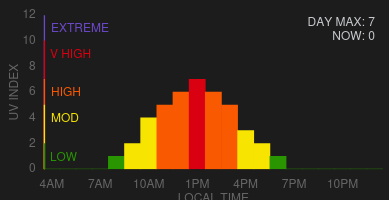

# Home Assistant EPA UV Index Integration




## Install instructions

### Recommended: Install with HACS

[](https://github.com/hacs/integration)

1. Navigate to the HACS add-on

2. Add https://github.com/davidn/epa_uvindex as a custom repository.

3. Go to the EPA UV Index integration and add it.

4. Restart Home Assistant

5. Go to Settings > Devices & Services, and on the Integration tab click "Add Integration". Select "EPA UV Index"

6. Enter the nearest city and state.

You will now have a sensor that provides the UV Index in that city.


### Manual Install

1. Copy all files to `config/custom_components`.

2. Restart Home Assistant.

3. Go to Settings > Devices & Services, and on the Integration tab click "Add Integration". Select "EPA UV Index"

4. Enter the nearest city and state.

You will now have a sensor that provides the UV Index in that city.

## Example dashboard card

The gauge screenshot above is from the following dashboard card:
```yaml
type: gauge
    entity: sensor.uv_index
    segments:
      - from: 0
        color: '#299501'
      - from: 3
        color: '#f7e401'
      - from: 6
        color: '#f95901'
      - from: 8
        color: '#d90011'
      - from: 11
        color: '#6c49C9'
    min: 1
    max: 12
    needle: true
```

The hourly card is can be found at https://github.com/davidn/uvindex-hourly.

# Usage

This integration provides a single sensor called `sensor.uv_index`. The value of the sensor is the max UV index for the current day.  The sensor also has a `forecast` attribute that provides hourly UV index predictions. This attribute is an array of dicts, each dict having a `datetime` and a `uv_index` entry with the time and UV index for that prediction. This comes directly from the EPA source, which currently provides a prediction for a sensible range of hours, on the hour, but could potentially change.

If you want a separate sensor with the current UV index, create a template sensor using the following template:

```python

  
    {{ forecast.uv_index }}
    
  

```
