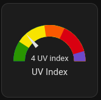

# Home Assistant NOAA UV Index Integration



## Install instructions

### Recommended: Install with HACS

[](https://github.com/hacs/integration)

1. Navigate to the HACS add-on

2. Add https://github.com/davidn/noaa_uvindex as a custom repository.

3. Go to the NOAA UV Index integration and add it.

4. Restart Home Assistant

5. Go to Settings > Devices & Services, and on the Integration tab click "Add Integration". Select "NOAA UV Index"

6. Enter the nearest city listed on [the NOAA UV Index bulletin](https://www.cpc.ncep.noaa.gov/products/stratosphere/uv_index/bulletin.txt).

You will now have a sensor that provides the UV Index in that city.


### Manual Install

1. Copy all files to `config/custom_components`.

2. Restart Home Assistant.

3. Go to Settings > Devices & Services, and on the Integration tab click "Add Integration". Select "NOAA UV Index"

4. Enter the nearest city listed on [the NOAA UV Index bulletin](https://www.cpc.ncep.noaa.gov/products/stratosphere/uv_index/bulletin.txt).

You will now have a sensor that provides the UV Index in that city.

## Example dashboard card

The screenshot above is from the following dashboard card:
```
type: gauge
    entity: sensor.uv_index
    segments:
      - from: 0
        color: '#299501'
      - from: 3
        color: '#f7e401'
      - from: 6
        color: '#f95901'
      - from: 8
        color: '#d90011'
      - from: 11
        color: '#6c49C9'
    min: 1
    max: 12
    needle: true
```
